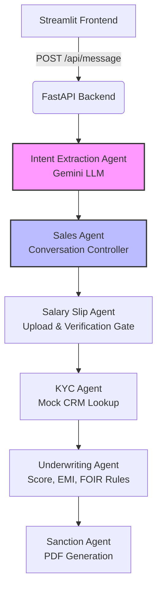

# 🏦 FinBot – Smart Loan Advisor (LLM-Powered NBFC Assistant)

FinBot is a **full-stack AI-powered loan advisory system** that simulates how a real NBFC processes a loan application — from conversation → intent extraction → KYC → underwriting → sanction letter generation.

It uses **Google Gemini (Pro account)** for:
- Natural language intent extraction
- Intelligent conversational questioning

and **rule-based agents** for:
- Credit checks
- FOIR calculation
- EMI computation
- PDF sanction letter generation

---

## 📌 Key Highlights

- 🤖 LLM-powered intent extraction (Gemini)
- 🧠 Multi-agent backend architecture
- 🔐 Mock KYC verification
- 📄 Automated sanction letter PDF
- 💬 Streamlit chat frontend
- ⚡ FastAPI backend

---

## 🏗️ Architecture Overview
The system follows a linear pipeline where each agent acts as a validation gate.


---
# 🧠 Agent-Based Design (Explained)
## 1️⃣ Intent Extraction Agent (LLM)

File: intent_llm.py

Uses Gemini (google-genai SDK) to extract structured data from free-form text.

Extracted Fields
{
  "loan_amount": number,
  "tenure_months": number,
  "purpose": "home | education | business",
  "salary": number,
  "phone": string,
  "pan": string
}

Gemini Prompt Strategy
- Strict JSON output
- No explanations
- Schema enforced
- Resilient fallback on parse failure


## 2️⃣ Sales Agent (Conversation Controller)

File: workers.py

Purpose:

- Ask exactly one missing field at a time
- Maintain conversational flow
- Never ask repeated or irrelevant questions


This ensures:

- Clean UX
- Predictable flow
- No hallucinated decisions

## 3️⃣ Salary Slip Agent (Hard Gate)

File: workers.py

Salary slip is mandatory.

Logic:

- If not uploaded → ask user
- If invalid → final rejection
- If verified → continue pipeline
- if session.get("salary_slip_verified"):
    return {"verified": True}


This mimics real NBFC compliance.

## 4️⃣ KYC Agent (Mock CRM Verification)

File: workers.py

Checks user phone + PAN against:

- backend/mock_crm.json


Returns:

- mock_score
- customer profile (name, PAN, phone)
- Failure → immediate rejection with reason.

## 5️⃣ Underwriting Agent (Rules Engine)

File: workers.py

Evaluates:

- Credit score
- EMI affordability
- FOIR (Fixed Obligation to Income Ratio)

Rules Applied

Rule	Outcome
- Score < 700	Reject
- FOIR > 20%	Reject
- Else	Approve

Uses utility functions:

- compute_emi
- calculate_foir
- calculate_final_interest_rate

## 6️⃣ Sanction Agent (PDF Generator)

File: utils.py

Generates a real PDF sanction letter using ReportLab.

Includes:

- Customer details
- Loan amount
- Tenure
- Interest rate
- EMI
- Date & reference ID

Saved at:

- backend/static_pdfs/

## 🖥️ Frontend (Streamlit)

File: frontend/app.py

Features:

- Chat-style UI
- Session persistence
- Salary slip upload UI
- Backend API integration

Endpoints used:

- /api/message
- /api/upload-salary-slip
- /api/pdf/{file}
## Project Structure
```text
finbot-proto/
├── backend/
│   ├── main.py
│   ├── intent_llm.py
│   ├── workers.py
│   ├── utils.py
│   ├── mock_crm.json
│   └── static_pdfs/
│
├── frontend/
│   └── app.py
│
├── .env
├── requirements.txt
└── README.md
  ```
